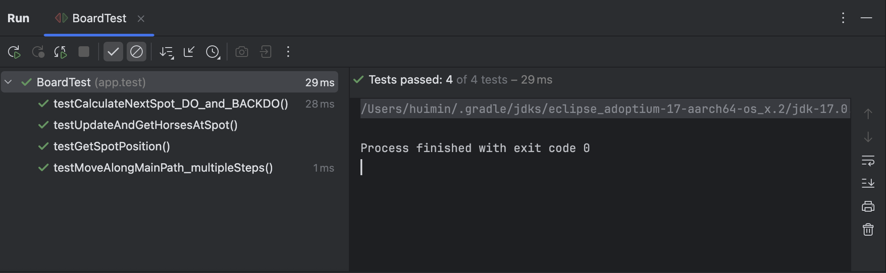
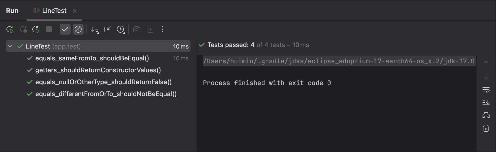
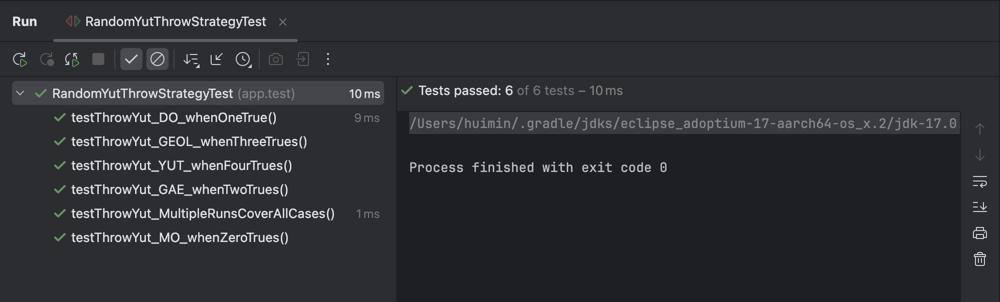

### 보고서 역할분담
1. 프로젝트 개요 - 은채
2. 유스케이스 모델 - 민혁
3. 설계 및 구현 리포트 (단계별로, 발전 과정 기술) - 민혁
4. UI를 교체했을 때 수정되어야 하는 부분들에 대한 설명을 보고서에 반드시 작성 - 은채
5. 테스트 리포트 - 휘민
6. GitHub 프로젝트 리포트 - 휘민

# 프로젝트 개요
 

# UseCase Model

# 설계 및 구현 리포트

## 주요 구현 목표
1. MVC 구조 적용
2. 여러 버전의 UI 프레임워크를 적용하기 위한 구현
    1. JavaSwing UI 구현
    2. JavaFX UI 구현
    3. 각 프레임워크 적용 시 코드 수정 최소화
3. 게임 설정 (보드 종류, 플레이어 수, 말 수) 구현
4. 게임 진행 상태 및 턴 관리 구현
    1. 윷, 모의 경우 윷 한번 더 던지기
    2. 말을 잡은 경우 윷 한번 더 던지기
    3. 나온 윷을 모두 사용해 말을 이동한 경우, 다음 플레이어에게 턴 넘기기
5. 랜덤 윷던지기와 지정 윷던지기, 2가지 버전의 윷던지기 구현
6. 보드 레이아웃 및 이동 전략 구현
    1. 사각형 보드 레이아웃 구현
    2. 오각형 보드 레이아웃 구현
    3. 육각형 보드 레이아웃 구현
7. 말 이동 전략 구현
    1. 말 업기, 말 잡기 구현
    2. 각 꼭짓점 및 중앙점에서 지름길로 이동하는 전략 구현
    3. 나온 윷에 해당하는 이동 구현

## 시스템 구성 및 설계 구조
### MVC 구조

#### 주요 Controller Class

- GameController

#### 주요 Model Class
**Object**

- Game
- Board
- Line
- Path
- Spot
- Yut
- Horse
    - Horse
    - HorseGroup
- Player

**Event**

- GameEvent
- GameEventListener(인터페이스)
- GameEventManager

**Strategy**

- BoardFactory
- BoardLayoutStrategy (인터페이스)
    - HexagonBoardLayoutStrategy
    - PentagonBoardLayoutStrategy
    - SquareBoardLayoutStrategy
- YutThrowStartegry (인터페이스)
    - RandomYutThrowStartegry
    - SpecificYutThrowStartegry

#### 주요 View Class

- GameView (인터페이스)
    - SwingGameView
    - JavaFXGameView
- GameViewFactory

### 옵저버 패턴

모델과 뷰 간 데이터 처리, 전달 등을 구현하기 위해, 옵저버 패턴을 적용하여 이벤트 기반으로 구현하였다.

이벤트가 발생하여 GameEventListener에 전달되면 이벤트를 수신하고 onGameEvent 메소드를 호출하여 처리한다. (Observer)

GameEventManager는 등록된 이벤트 리스너 목록을 저장 및 관리한다. (Subject)

UI가 필요한 윷놀이 게임의 특성 상, 주기적으로 모델들의 상태 등에 따라 뷰를 주기적으로 업데이트해야 한다. 이를 위해 옵저버 패턴을 사용하여, 말 이동, 턴 변경 등을 이벤트로 관리하고 이벤트 발생 시 자동으로 변경사항을 뷰에 반영하도록 설계하였다. 이를 통해 모델(Game)이 직접 뷰(GameView)를 호출하지 않고도 데이터 처리 및 전달을 수행할 수 있다.

또한 요구사항에 의하면 여러가지 UI 프레임워크로 UI를 개발해야 한다. 따라서 이벤트 기반으로 설계하여, 이벤트가 수신해서 처리하는 뷰를 바꿔 끼우는 방식으로 설계하였다. 이를 통해 UI 프레임워크에 독립적인 로직을 구성할 수 있다.

### 전략 패턴

윷 던지기와 보드 레이아웃 부분에서 전략 패턴을 사용하였다.

요구사항에 의하면 윷 던지기 방식이 랜덤과 지정, 두 가지 방식을 구현해야 한다.

따라서 기본적인 윷던지기 전략 인터페이스(YutThrowStrategy)를 만들고, 해당 전략 인터페이스를 랜덤 던지기와 지정 던지기 클래스에서 구현하도록 하였다.

또한, 보드 레이아웃의 경우, 사각형, 오각형, 육각형 보드를 사용할 수 있어야 한다.

따라서 기본적인 보드 레이아웃 전략 인터페이스(BoardLayoutStrategy)를 만들고, 각각의 보드 모양에 맞는 구체적인 보드 레이아웃 전략 클래스를 구현하여 3가지 모양의 보드를 구현하였다.

전략 패턴을 사용함으로써 새로운 윷던지기 방식이 추가되거나, 새로운 레이아웃이 추가되는 등 확장에 용이한 설계를 하였다.

실제로 보드 레이아웃의 경우, 사각형 보드 버전으로만 먼저 구현하였다. 추후 오각형, 육각형에 해당하는 새로운 보드 레이아웃 전략 클래스를 구현하여 최종적으로 다양한 보드를 사용할 수 있는 윷놀이 게임을 개발하였다.

## 주요 클래스 설명
### Controller

#### GameController

**역할**

이 프로그램에서 Game 모델과 GameView 사이에서 이벤트를 통해 중재하는 역할

뷰로부터 이벤트를 수신받아 모델에 상태 변경 등을 지시한다.

모델의 상태, 이벤트를 통해 뷰가 그려질 수 있도록 뷰에 데이터를 전달한다.

**기능**

- 뷰 초기화
    - 메소드: initializeGame
    - UI를 그리는 뷰를 초기화하고 설정하기 위한 다이얼로그를 띄워 게임설정을 진행할 수 있도록 한다.
- 게임 세팅
    - 메소드: setupGame
    - 사용자가 입력한 설정값으로 Game 클래스를 세팅하고, UI를 설정값에 맞게 세팅한다.
- 윷 던지기 가능 여부 관리
    - 메소드: handleYutThrow
    - 윷이나 모로 한번 더 던질 수 있거나, 아직 윷을 던지지 않은 경우만 윷을 던질 수 있도록 관리한다.
- 사용할 윷 선택 및 이동할 말 선택
    - 메소드: handleHorseSelection
    - 사용자가 특정 말을 클릭했을 때 호출된다.
    - 현재 사용 가능한 윷 결과 목록을 View에 요청해 선택하도록 하고, 유효한 선택이 있을 경우 game.moveHorse 메소드를 호출하여 말 이동을 처리한다.
- 게임 재시작
    - 메소드: handleRestartGame
    - (게임이 끝난 후 사용자가 재시작을 선택하는 경우) Game 클래스의 restart 메소드를 호출하여 게임 상태를 SET_UP 상태로 변경 및 새로운 게임을 시작할 수 있도록 한다.
- 게임 종료
    - 메소드: handleExitGame
    - (게임이 끝난 후 사용자가 종료를 선택하는 경우) 각 UI 프레임워크 종류에 맞춰 UI 종료 작업을 수행한다.

### Model

#### Game

**역할**

이벤트를 받아 전반적인 게임 관리 및 진행 역할

**주요 기능**

- 게임 상태 관리
    - GameState Enum을 이용하여, 게임의 상태를 SETUP, IN_PROGRESS, FINISHED 3가지 경우로 관리한다.
- 게임 실행
    - 메소드: setupGame
    - 최초 게임 설정 및 실행을 수행한다.
- 턴 관리
    - 메소드: nextTurn, getCurrentPlayer, getCurrentResults, canThrowAgain
    - 말 이동이 모두 끝나면 nextTurn 메소드가 실행된다. 현재 플레이어를 다음 플레이어로 업데이트하고, 윷결과 등 초기화하여 턴을 넘긴다.
    - 턴 관리를 위해 필요한 현재 플레이어 조회, 현재 윷 결과 목록 조회, 윷 던지기를 한번 더 할 수 있는 여부 조회 기능을 구현하였다.
- 말 이동
    - 메소드: hasMovableHorses, moveHorse, captureHorses, groupHorses
    - 사용자의 윷 결과를 바탕으로 이동 가능한 말이 있는지 체크한다.
    - 게임 상태와 말이 해당 플레이어의 것이 맞는지, 말의 완주 여부를 체크한다.
    - 말이 그룹 상태인지, 단일 상태에 인지에 따라 말이 이동할 위치를 계산 및 이동한다.
    - 해당 위치에 같은 팀의 말이나 상대 팀의 말이 있는지 체크하여, 그룹핑 또는 잡기를 수행한다.
        - captureHorses, groupHorses
    - 사용자가 선택한 말과 윷 결과로 말을 이동시키고, 사용한 윷결과는 저장된 리스트에서 제거한다.
    - 모든 이동이 끝나면 다음 플레이어에게 턴을 넘긴다.
- 윷던지기
    - 메소드: throwYut
    - 윷던지기 전략(랜덤 또는 지정)에 따라 Yut 클래스의 throwYut 메소드를 실행하여 윷던지기 수행 후 윷 결과를 저장한다.
    - 말이 없는 상태에서 빽도가 나오면 자동으로 턴을 넘긴다.
    - 윷, 모가 나오면 한번 더 던질 수 있도록 한다.
- 게임 종료 및 승자 판별
    - 메소드: endGame
    - 게임 상태를 FINISHED 상태로 초기화하고 승자를 결정 및 게임 종료 이벤트를 실행한다.
- 게임 재시작
    - 메소드: restart
    - 게임 상태를 SET_UP 상태로 초기화하여 게임을 다시 시작할 수 있도록 상태를 관리한다.

#### Board, Line, Path, Spot

**역할**

게임이 진행되는 판 상태 관리 및 이동 경로 시스템 제공

Board: 게임 판 상태 및  이동 경로 계산

Spot: 말이 서있을 수 있는 개별 칸

Path: 메인 루트, 대각선 지름길 등, 스팟으로 연결된 이동 경로

Line: Spot 간의 연결 정보를 시각적으로 표현하는 선 (UI 그리기 용도)

**기능**

**Board**

- spot, path, line, 도착지점(finishSpot) 데이터와 말들의 위치 데이터 저장
- 말 위치 업데이트
    - 메소드: updateHorsePosition
    - 기존 말들의 위치 리스트를 초기화하고, 현재 말들의 위치를 저장한다.
    - Game 클래스에서 실행
- 윷결과에 따라 이동 경로 계산
    - 메소드: calculateNextSpot, moveAlongPath, moveAlongMainPath, calculateFirstMove
    - 말의 출발 여부, 말의 완주 여부, 윷결과가 빽도인지 여부를 확인하고, 메인 경로와 지름길 경로 중 해당하는 곳 판별하여 말이 이동할 위치를 계산한다.

**Spot**

- 고유 Id, 시작점 여부, 종료점 여부, 꼭짓점 여부 데이터 저장
- 해당 스팟에서 이동 가능한 다음 스팟 데이터 저장 (메인 경로)
    - 메소드: addNextSpot
- 윷 결과에 따라 이동할 스팟 데이터 조회
    - 메소드: getNextSpot
    - 재귀적으로 각 윷 결과에 해당하는 위치의 스팟 데이터를 계산하여 제공한다.
- 해당 스팟에서 이동 가능한 경로 데이터 저장
    - 메소드: addNextPath
- 각 윷 결과에 따라 이동할 경로 데이터 제공
    - 메소드: getNextPath

**Path**

- 경로에 스팟 추가
    - 메소드: addSpot
- 이동 칸 수만큼 이동한 위치의 스팟 계산
    - 메소드: getSpotAfterMove

**Line**

- from, to 로 시작 스팟과 종료 스팟 데이터 저장

#### Player

**역할**

윷놀이 게임에 참여한 사용자로 게임 진행의 주체

말의 소유자

**기능**

- 플레이어 이름(번호), UI 내 표현 색상, 소유한 말 리스트 데이터 저장 및 관리
- 플레이어 객체 생성 시, 내부적으로 게임 시작 때 세팅한 말 갯수만큼 말 생성
- 승리 여부를 확인하기 위해 가진 말들이 모두 완주했는지 여부 확인
    - 메소드: isAllHorsesFinished
- 종료된 말의 갯수 조회
    - 메소드: getFinishedHorseCount

#### Horse, HorseGroup

**역할**

게임판 위를 이동하며 플레이어의 승패를 결정짓는 객체

각 플레이어에게 속해 있다.

HorseGroup은 같은 플레이어의 말끼리 업기(그룹핑)을 한 경우, 속한 말들의 이동 및 제거를 동시에 관리하기 위한 객체

**기능**

- 말 식별자, 소유 플레이어, 현재 위치, 완주 여부, 그룹핑 데이터 저장 및 관리
- 말 이동
    - 메소드: move
    - 말의 완주 여부, 그룹핑 여부 확인한다.
    - 단일 말과 그룹핑 말은 각자의 move 메소드로 이동 수행한다.
    - 말의 현재 위치를 목적지 스팟으로 업데이트하고, 목적지가 도착지점이라면 완주 여부를 true로 설정한다.
- (HorseGroup의 경우) 그룹핑된 말이 잡히는 경우를 위한 말의 그룹핑 해제 기능
    - 메소드: removeHorse
    - 그룹된 말들의 리스트를 초기화하고 모든 말의 그룹을 null로 설정한다.
- (HorseGroup의 경우) 그룹에 말 추가
    - 메소드: addHorse

#### Yut

**역할**

윷 던지기 결과를 생성한다.

랜덤 또는 지정 방식의 윷던지기 중 하나를 선택하여 수행할 수 있다.

**기능**

- 랜덤, 지정 중 윷 던지기 전략 설정
    - 메소드: setStrategy
- 윷 던지기
    - 메소드: throwYut
    - 설정되어 있는 윷 던지기 전략으로 윷 던지기를 수행하고 결과를 반환한다.

#### YutThrowStartegry

**역할**

랜덤 윷던지기와 지정 윷던지기 구현을 위해 추상화한 전략 인터페이스

**메소드**

throwYut

throwYut 메소드로 각 전략에 해당하는 알고리즘으로 윷던지기를 구현하도록 하였다.

#### BoardLayoutStrategy

**역할**

사각형, 오각형, 육각형 보드 구현을 위해, Spot, Line, Path 등 게임판의 레이아웃 생성 전략을 추상화한 전략 인터페이스

**메소드**

createBoard

createBoard 메소드로 사각형, 오각형, 육각형 보드에 따라 각각의 UI를 그리기 전략 및 이동 전략에 맞게 보드를 생성하도록 구현하였다.

#### GameEvent

**역할**

게임 내에서 발생하는 이벤트 객체

GameEventType Enum을 사용해 이벤트의 종류 데이터를 가진다. (type 필드)

플레이어, 윷 결과, 승자 등등 이벤트에 담을 수 있는 정보를 Map 형식으로 저장한다. (data 필드)

다양한 이벤트를 공통적인 구조로 관리할 수 있도록 설계하였다.

이벤트 종류는 다음과 같다.

GAME_SETUP: 게임 설정
YUT_THROW: 윷 던지기
HORSE_MOVE: 말 이동
CAPTURE: 말 잡기
GROUP: 말 업기
TURN_CHANGE: 턴 변경
GAME_OVER: 게임 종료

#### GameEventListenr

**역할**

이벤트를 수신하는 이벤트 리스너 인터페이스

onGameEvent 메소드를 통해 이벤트를 수신하여 처리한다.

GameView에서 이 인터페이스를 상속받고, 이 GameView 인터페이스는 JavaFXGameView, SwingGameView 등 각 UI 프레임워크의 GameView가 구현한다.

#### GameEventManager

**역할**

이벤트 리스너를 등록하고 이벤트를 전달하는 역할

**기능**

- 이벤트 리스너 등록
    - 메소드: addListener
- 등록된 이벤트 리스너에게 이벤트 전달
    - 메소드: fireEvent

## UI를 교체했을 때 수정된 부분

## 개발 과정

### 1. 개발 전

먼저 여러차례 회의를 통해 요구사항 명세서를 분석하였다.

분석한 요구사항을 바탕으로 유스케이스 다이어그램을 그려보며 필요한 기능을 파악하였다.

이후 간단한 버전의 클래스 다이어그램을 그리며 필요한 모델 객체들을 우선 정의하였다.

### 2. 개발 초기

개발 초기에는 사각형 보드의 윷놀이 게임을 우선 개발하고, 추후 오각형, 육각형 보드를 개발하기로 하였다.

이때 전반적인 로직을 그대로 적용하며 오각형, 육각형 보드로 확장하기 위해, 전략 패턴과 팩토리 패턴을 사용하여 설계하였다.

이렇게 사각형 보드로 게임 시작, 게임 설정, 말 이동, 말 선택, 경로 계산, JavaSwing으로 뷰 그리기 등 기본적인 기능을 구현하였다.

사각형 보드 윷놀이 게임을 개발할 때, 요구사항 중 하나인 ‘여러 UI 프레임워크로 윷놀이 게임 구현’을 위해 MVC 구조와 이벤트 기반으로 설계하였다.

기본적인 기능을 구현한 후 테스트 코드와 실사용 테스트를 통해 버그 등을 수정하며 윷놀이 게임의 전반적인 알고리즘을 구현하였다.

### 3. 개발 중반

이후, 사각형 보드로 구현했던 윷놀이 게임에 오각형 보드와 육각형 보드의 레이아웃 전략을 구현하고 JavaSwing으로 보드 뷰도 구현하였다.

이후 테스트를 통해 요구사항대로 올바르게 동작하는지 확인하였다.

또한 MVC 구조에 적합하게 구현되었는지 점검하며 리팩토링을 진행하였다.

### 4. 개발 후반

JavaSwing으로 구현했던 윷놀이 게임을 기반으로 JavaFX 프레임워크를 사용해 뷰 그리기를 구현하였다.

또한, JavaFX 프레임워크에 맞게 GameController와 GameViewFactory, YutGameApplication 클래스를 일부 수정하여, JavaFX 프레임워크로도 윷놀이 게임을 구현하였다.

최종적으로 구현한 로직들을 테스트하기 위해 전체적인 테스트 코드를 작성하며 프로그램이 버그없이 요구사항에 맞게, 잘 동작하는지 테스트하였다.

# 테스트 리포트
### 1. Test 환경

사용한 테스트 프레임워크: JUnit5

개발환경

- Java version 21.0.2
- Gradle version 8.14.1

### 2. Test 항목 및 시나리오

## BoardTest

| 테스트 메소드                         | 검증 포인트                                                            | JUnit Assertion 예시                                                         |
| ------------------------------------- | ----------------------------------------------------------------------- | ----------------------------------------------------------------------------- |
| **testGetSpotPosition**               | Spot ID에 매핑된 좌표(Point)를 올바르게 반환하는지                      | `assertEquals(new Point(10,0), board.getSpotPosition(s1));`                 |
| **testUpdateAndGetHorsesAtSpot**      | - Spot에 말 배치 후 조회 - 말 완주 처리 시 보드에서 제거되는지      | `assertEquals(1, atS1.size());` `assertTrue(...isEmpty());`              |
| **testCalculateNextSpot_DO_and_BACKDO** | - DO 이동: 다음 칸으로 - BACKDO 이동: 이전 칸으로 - 시작 칸 BACKDO 시 null 반환 | `assertEquals(s2, nextFromS1);` `assertNull(...);`                        |
| **testMoveAlongMainPath_multipleSteps** | - GAE(2) 이동 시 여러 칸 건너뛰어 도착 - 경로 끝 넘으면 도착 칸 반환 | `assertEquals(s2, twoSteps);` `assertEquals(s2, overshoot);`             |

✅ BoardTest의 빌드와 테스트(위에 적힌 테스트 메소드 전부)를 모두 통과한 결과인 BUILD SUCCESSFUL을 확인할 수 있음

## GameEventManagerTest

| 테스트 메소드                                 | 검증 포인트                                               | JUnit Assertion 예시            |
| --------------------------------------------- | ---------------------------------------------------------- | ------------------------------- |
| **addListenerAndFireEvent_shouldCallListener** | 지정 이벤트 타입 리스너 등록 후 `fireEvent` 시 해당 리스너 호출 여부 | `assertTrue(called.get());`     |
| **duplicateListener_shouldBeRegisteredOnce**   | 동일 리스너 중복 등록 시 한 번만 호출되는지 (간접 검증)    | `assertTrue(called.get());`     |

✅ GameEventManagerTest의 빌드와 테스트(위에 적힌 테스트 메소드 전부)를 모두 통과한 결과인 BUILD SUCCESSFUL을 확인할 수 있음

## GameTest

| 테스트 메소드                                        | 검증 포인트                                                                                   | JUnit Assertion 예시                                                                                 |
| --------------------------------------------------- | ---------------------------------------------------------------------------------------------- | ---------------------------------------------------------------------------------------------------- |
| **setupGame_throwsOnTooFewPlayers**                 | 플레이어 수가 2 미만일 때 `IllegalArgumentException` 발생 여부                                  | `assertThrows(IllegalArgumentException.class, () -> …);`                                             |
| **testSetupGame_validParameters_initializesCorrectly** | 유효 파라미터로 `setupGame` 호출 시 내부 상태(플레이어 수, 상태, 보드, 윷결과 리스트)가 올바른지 확인 | `assertEquals(2, players.size());` `assertEquals(IN_PROGRESS, game.getState());`                 |
| **testThrowYut_specificResult_addedToCurrentResults** | 지정 던지기 모드에서 결과가 `currentResults` 에 추가되고 `canThrowAgain()` 상태가 올바른지 검증   | `assertEquals(YutResult.DO, result);` `assertFalse(game.canThrowAgain());`                       |
| **testThrowYut_MO_canThrowAgainTrue**               | MO(5) 결과 시 `canThrowAgain()`이 `true` 인지                                                  | `assertTrue(game.canThrowAgain());`                                                                  |
| **testMoveHorse_DO_movesHorseAlongMainPath**        | DO(1) 이동 시 말의 `currentSpot.id` 가 1 증가하고, 사용된 결과가 리스트에서 제거되는지         | `assertEquals(1, h.getCurrentSpot().getId());` `assertTrue(game.getCurrentResults().isEmpty());` |
| **testCaptureEnemyHorse_returnsToStartAndCanThrowAgain** | 상대 말 잡기 시 상대 말이 시작 칸으로 복귀되고, 공격자가 한 번 더 던질 수 있는지 확인             | `assertTrue(defenderHorse.isAtStart());` `assertTrue(game.canThrowAgain());`                     |

✅ GameTest의 빌드와 테스트(위에 적힌 테스트 메소드 전부)를 모두 통과한 결과인 BUILD SUCCESSFUL을 확인할 수 있음

## HorseGroupTest

| 테스트 메소드                                      | 검증 포인트                                                             | JUnit Assertion 예시                                                            |
| ------------------------------------------------- | ------------------------------------------------------------------------ | -------------------------------------------------------------------------------- |
| **constructorAddsInitialHorse**                   | 생성자 호출 시 초기 말이 그룹에 포함되고, 말의 `group` 참조가 설정되는지 | `assertTrue(horses.contains(h1));` `assertEquals(group, h1.getGroup());`       |
| **addHorseAddsNewHorse**                          | `addHorse(h2)` 호출 시 그룹 크기가 2가 되고, `h2.getGroup()` 이 `group` 인지 확인 | `assertEquals(2, horses.size());` `assertEquals(group, h2.getGroup());`       |
| **addHorseNullOrDuplicateDoesNothing**            | `null` 또는 중복 말 추가 시 그룹 변화가 없는지                           | `assertEquals(1, group.getHorses().size());`                                     |
| **removeHorseRemovesAndClearsGroupWhenOneLeft**   | 두 마리 중 하나 제거 후 남은 한 마리까지 그룹 해제 및 `group` 참조가 `null` 이 되는지 | `assertTrue(group.getHorses().isEmpty());` `assertNull(h2.getGroup());`       |
| **removeHorseWhenNotInGroupDoesNothing**          | 그룹에 없는 말 제거 시 아무 변화 없는지                                  | `assertEquals(1, group.getHorses().size());`                                     |
| **moveSetsAllHorsesToDestinationAndMarksFinished** | 일반/도착 칸으로 이동 시 모든 말의 `currentSpot` 과 `isFinished` 플래그 상태 검증 | `assertEquals(normalSpot, h1.getCurrentSpot());` `assertTrue(h1.isFinished());` |
| **getHorsesReturnsUnmodifiableList**              | `getHorses()` 로 반환된 리스트가 수정 불가능한지                         | `assertThrows(UnsupportedOperationException.class, () -> list.add(h2));`         |

✅ HorseGroupTest의 빌드와 테스트(위에 적힌 테스트 메소드 전부)를 모두 통과한 결과인 BUILD SUCCESSFUL을 확인할 수 있음

## HorseTest

| 테스트 메소드                             | 검증 포인트                                                                                 | JUnit Assertion 예시                                                            |
| ---------------------------------------- | -------------------------------------------------------------------------------------------- | ------------------------------------------------------------------------------- |
| **testInitialState**                     | - 초기 `id`, `owner` - `currentSpot` null - `isFinished`, `isInGroup` false           | `assertEquals(7, horse.getId());` `assertNull(horse.getCurrentSpot());`     |
| **testMoveUpdatesSpot**                  | `move(spotA)` 호출 시 - `currentSpot` 업데이트 - `isFinished` false                   | `assertTrue(moved);` `assertEquals(spotA, horse.getCurrentSpot());`         |
| **testMoveToFinishSpotSetsFinished**     | `move(spotFinish)` 호출 시 - `currentSpot` 업데이트 - `isFinished` true               | `assertTrue(horse.isFinished());`                                               |
| **testCannotMoveWhenAlreadyFinished**    | 이미 `finished` 상태일 때 `move()` false, `currentSpot` 변하지 않는지                       | `assertFalse(moved);` `assertEquals(spotA, horse.getCurrentSpot());`         |
| **testCannotMoveWhenInGroup**            | 그룹에 속한 말일 때 `move()` false, `currentSpot` 변하지 않는지                            | `assertFalse(moved);` `assertNull(horse.getCurrentSpot());`                  |
| **testToStringContainsIdAndOwnerName**   | `toString()` 결과에 `id` 와 `owner.name` 포함 여부                                         | `assertTrue(str.contains("id=7"));` `assertTrue(str.contains("Tester"));`    |

✅ HorseTest의 빌드와 테스트(위에 적힌 테스트 메소드 전부)를 모두 통과한 결과인 BUILD SUCCESSFUL을 확인할 수 있음

## LineTest

| 테스트 메소드                                      | 검증 포인트                                                          | JUnit Assertion 예시                                                         |
| ------------------------------------------------- | --------------------------------------------------------------------- | ----------------------------------------------------------------------------- |
| **equals_sameFromTo_shouldBeEqual**               | 동일 `from`/`to` 로 생성한 두 객체가 `equals` 와 `hashCode` 동등      | `assertEquals(l1, l2);` `assertEquals(l1.hashCode(), l2.hashCode());`     |
| **equals_differentFromOrTo_shouldNotBeEqual**     | `from`/`to` 순서가 다르거나 `to` 가 다를 때 `equals` false            | `assertNotEquals(l1, l2);` `assertNotEquals(l1, l3);`                     |
| **equals_nullOrOtherType_shouldReturnFalse**      | `null` 또는 다른 타입과 비교 시 `equals` false                        | `assertNotEquals(l, null);` `assertNotEquals(l, "string");`               |
| **getters_shouldReturnConstructorValues**         | `getFrom()`/`getTo()` 가 생성자 인자 객체를 그대로 반환               | `assertSame(a, l.getFrom());` `assertSame(b, l.getTo());`                 |

✅ LineTest의 빌드와 테스트(위에 적힌 테스트 메소드 전부)를 모두 통과한 결과인 BUILD SUCCESSFUL을 확인할 수 있음

## PathTest

| 테스트 메소드                               | 검증 포인트                                                      | JUnit Assertion 예시                                                             |
| ------------------------------------------ | ----------------------------------------------------------------- | --------------------------------------------------------------------------------- |
| **testNameAndShortcutFlag**                | 생성자 인자 `name`, `isShortcut` 필드 반영 여부                 | `assertEquals("main", mainPath.getName());` `assertTrue(shortcutPath.isShortcut());` |
| **testAddSpotAndPrevSpotLinking**          | `addSpot()` 후 `getSpots()` 순서, 각 Spot 의 `prevSpot` 연결     | `assertSame(s0, list.get(0));` `assertSame(s0, s1.getPrevSpot());`            |
| **testGetLastSpotEmptyAndNonEmpty**        | 빈 경로 `getLastSpot()` null, Spot 추가 시 마지막 요소 반환      | `assertNull(empty.getLastSpot());` `assertSame(s1, mainPath.getLastSpot());`  |
| **testGetSpotAfterMoveValid**              | 경로 내 n칸 이동 시 올바른 Spot 반환                             | `assertSame(s1, mainPath.getSpotAfterMove(s0,1));` `assertSame(s2, mainPath.getSpotAfterMove(s0,2));` |
| **testGetSpotAfterMoveInvalid**            | 경로 벗어남, 존재하지 않는 Spot, 빈 경로 경우 null 반환         | `assertNull(mainPath.getSpotAfterMove(s0,5));` `assertNull(empty.getSpotAfterMove(s0,1));` |
| **testGetSpotsUnmodifiable**               | `getSpots()` 로 반환된 리스트 수정 시 예외 발생                 | `assertThrows(UnsupportedOperationException.class, () -> spotsView.add(s1));`     |

✅ PathTest의 빌드와 테스트(위에 적힌 테스트 메소드 전부)를 모두 통과한 결과인 BUILD SUCCESSFUL을 확인할 수 있음

## RandomYutThrowStrategyTest

| 테스트 메소드                                | 검증 포인트                                               | JUnit Assertion 예시                                                     |
| ------------------------------------------- | ---------------------------------------------------------- | ------------------------------------------------------------------------- |
| **testThrowYut_MO_whenZeroTrues**           | `nextBoolean()` 모두 false → `MO` 반환                     | `assertEquals(YutResult.MO, strategy.throwYut());`                     |
| **testThrowYut_DO_whenOneTrue**             | 정확히 1회 true → `DO` 반환                                | `assertEquals(YutResult.DO, strategy.throwYut());`                     |
| **testThrowYut_GAE_whenTwoTrues**           | 정확히 2회 true → `GAE` 반환                               | `assertEquals(YutResult.GAE, strategy.throwYut());`                    |
| **testThrowYut_GEOL_whenThreeTrues**        | 정확히 3회 true → `GEOL` 반환                              | `assertEquals(YutResult.GEOL, strategy.throwYut());`                   |
| **testThrowYut_YUT_whenFourTrues**          | 4회 모두 true → `YUT` 반환                                 | `assertEquals(YutResult.YUT, strategy.throwYut());`                    |
| **testThrowYut_MultipleRunsCoverAllCases**  | 랜덤 반복 실행 시 null 아니며 가능한 결과만 반환           | `assertTrue(Set.of(YutResult.values()).contains(r));`                  |

✅ RandomYutThrowStrategyTest의 빌드와 테스트(위에 적힌 테스트 메소드 전부)를 모두 통과한 결과인 BUILD SUCCESSFUL을 확인할 수 있음

## SpotTest

| 테스트 메소드                                    | 검증 포인트                                                          | JUnit Assertion 예시                                                         |
| ----------------------------------------------- | --------------------------------------------------------------------- | ----------------------------------------------------------------------------- |
| **testIdAndFlags**                              | `id`, `isStart`, `isCorner`, `isFinish` 플래그 초기값 올바른지       | `assertEquals(0, s0.getId());` `assertTrue(s0.isStart());`               |
| **testAddNextSpotAndPrevSpot**                  | `addNextSpot(YUT/GAE 등)` 시 `getNextSpot()`, `prevSpot` 설정 여부 | `assertSame(s1, s0.getNextSpot(YutResult.DO));` `assertSame(s0, s1.getPrevSpot());` |
| **testGetNextSpotChaining_DO_GAE_GEOL**         | 체이닝된 DO/GAE/GEOL 호출 시 올바른 Spot 반환, 오버슈트 시 null   | `assertSame(s2, s0.getNextSpot(YutResult.GAE));` `assertNull(s0.getNextSpot(YutResult.YUT));` |
| **testBackdo**                                  | `BACKDO` 호출 시 `prevSpot` 반환, 시작 칸 시 null 반환             | `assertSame(s1, s2.getNextSpot(YutResult.BACKDO));` `assertNull(s0.getNextSpot(YutResult.BACKDO));` |
| **testAddAndGetNextPath**                       | `addNextPath()` 후 `hasPath()`, `getNextPath()` 동작 여부         | `assertTrue(s0.hasPath(YutResult.YUT));` `assertSame(shortcut, s0.getNextPath(YutResult.YUT));` |
| **testGetNextSpotWithOnlyPathEntry**            | Path 엔트리만 있을 때 기본 로직(없으면 null) 동작 확인            | `assertNull(s0.getNextSpot(YutResult.YUT));`                                |
| **testToString**                                | `toString()` 결과가 `"Spot{id=<id>}"` 형태인지                   | `assertEquals("Spot{id=0}", s0.toString());`                               |

✅ SpotTest의 빌드와 테스트(위에 적힌 테스트 메소드 전부)를 모두 통과한 결과인 BUILD SUCCESSFUL을 확인할 수 있음

# Github 프로젝트 리포트
## GitHub 사용 & 개발 워크플로우

### 1. Repository Structure

- `main` 브랜치
    - README.md
- `dev` 브랜치
    - 일일 통합 브랜치 (최종 코드가 담긴 Branch)
    - 기능이 완성될 때마다 Pull Request로 머지
- `feat/<숫자(이슈번호)>` 브랜치
    - 새로운 기능이나 개선 작업마다 생성
    - 예: `feat/35` 등

### 2. Issues (15개)

#1 Write README.md

#4 Horses, Player → branch `feat/4` -m ‘replaced Player and Horse’

#6 Yut, Game, Board

#7 add hasThrownYut → branch `feat/7` -m ‘add hasThrownYut’

#14 각 꼭짓점, 중앙점에서 지름길로 이동하지 않고 있음 → branch `feat/14` -m ‘도착 안되던거 고침’

#15 도착점에서 상대편 말이 잡힘 

#18 말이 하나도 없을 때 빽도가 나오면 윷을 못던짐

#20 대각선 빽도 

#21 빽도 오류 

#24 오각형, 육각형 view → branch `feat/24` -m ‘오각형, 육각형 view’

#26 오각형, 육각형 Path → branch `feat/26` -m ‘육각형, 오각형 Path 추가’

#33 MVC 패턴 

#34 Strategy 함수 분리

#35 Create Test Code

#36 JavaFX Game View

### 3. Branches

### ✅ “gradle-test-env” branch

- Gradle을 활용하여 JUnit 테스트 코드를 돌림.
- Gradle을 구동하는데 필요한 모든 파일 및 폴더를 담은 브랜치.
- JavaFXGameView.java의 `ChoiceDialog<YutResult> dialog = new ChoiceDialog<>(options.getFirst(), options);` 를 `ChoiceDialog<YutResult> dialog = new ChoiceDialog<>(options.get(0), options);` 으로 바꿈. (Gradle 구동 시 오류가 발생하여 이 부분만 수정함.)

# GitHub Link
[GitHub - betterrchae/sw01-12](https://github.com/betterrchae/sw01-12.git)